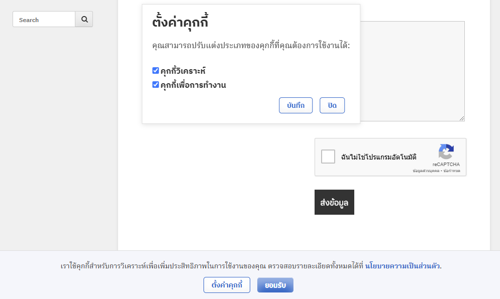

# WP Cookies & Privacy Policy

ปลั๊กอิน WordPress สำหรับแสดงแถบคุกกี้และนโยบายความเป็นส่วนตัว พร้อมตัวเลือกการตั้งค่าคุกกี้

## คุณสมบัติ
- แสดงแถบคุกกี้สำหรับให้ผู้ใช้ยินยอม
- มีป๊อปอัปสำหรับตั้งค่าคุกกี้ตามความต้องการ
- รองรับฟอนต์ Google `Noto Serif Thai` เพื่อการอ่านภาษาไทยที่ชัดเจน
- จัดการการตั้งค่าผ่าน AJAX
- ปรับแต่งสไตล์และฟังก์ชันได้ตามต้องการ

## วิธีติดตั้ง
1. ดาวน์โหลดปลั๊กอินในรูปแบบไฟล์ `.zip`
2. ไปที่หน้า **ปลั๊กอิน > เพิ่มใหม่ > อัปโหลดปลั๊กอิน** ใน WordPress
3. อัปโหลดไฟล์ `.zip` และเปิดใช้งานปลั๊กอิน

## วิธีใช้งาน
1. เมื่อเปิดใช้งาน ปลั๊กอินจะแสดงแถบคุกกี้ที่ด้านล่างของเว็บไซต์โดยอัตโนมัติ
2. ผู้ใช้สามารถคลิกปุ่ม **"ตั้งค่าคุกกี้"** เพื่อเปิดหน้าต่างตั้งค่าคุกกี้ หรือคลิก **"ยอมรับ"** เพื่อยอมรับการใช้งานคุกกี้ทั้งหมด
3. การตั้งค่าของผู้ใช้จะถูกบันทึกไว้ในคุกกี้

ภาพตัวอย่างของเว็บไซต์:

## ความต้องการระบบ
- WordPress เวอร์ชัน 5.0 หรือสูงกว่า
- PHP เวอร์ชัน 7.2 หรือสูงกว่า

## การปรับแต่ง
- แก้ไขไฟล์ `css/style.css` เพื่อปรับแต่งสไตล์
- ปรับเปลี่ยนฟังก์ชันใน `js/script.js` สำหรับพฤติกรรมที่ซับซ้อนยิ่งขึ้น

## ใบอนุญาต
ปลั๊กอินนี้เผยแพร่ภายใต้ [GPL-3.0 License](https://www.gnu.org/licenses/gpl-3.0.html)

## การมีส่วนร่วม
ยินดีรับคำแนะนำและการพัฒนาเพิ่มเติม! สามารถส่ง pull request หรือรายงานปัญหาได้ที่ [GitHub](https://github.com/nakharinit/WP-Cookies-Privacy-Policy)
